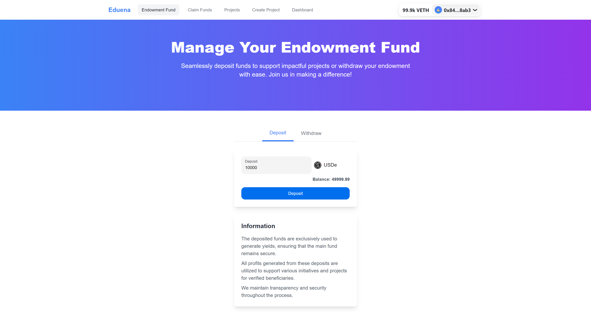
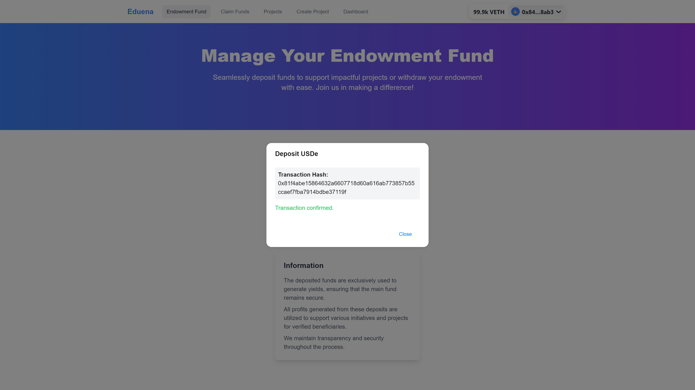
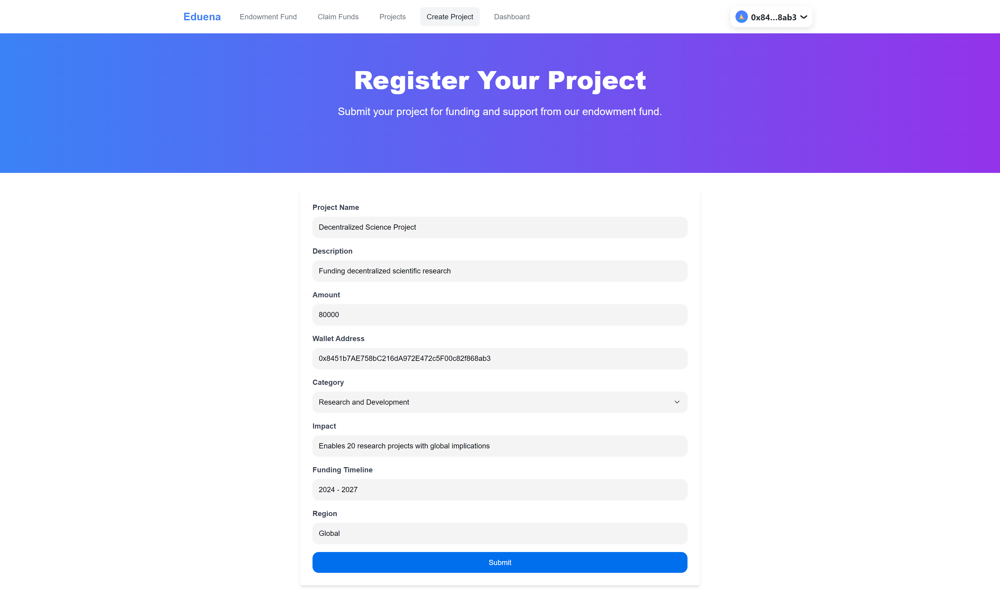
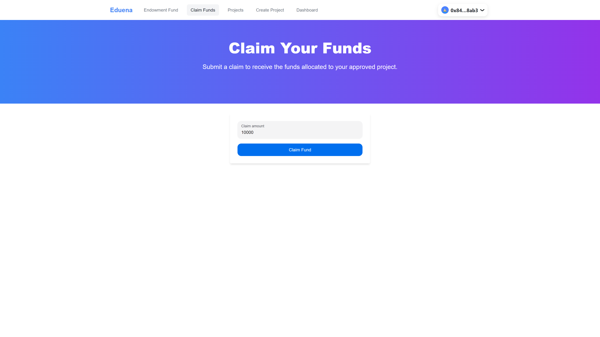
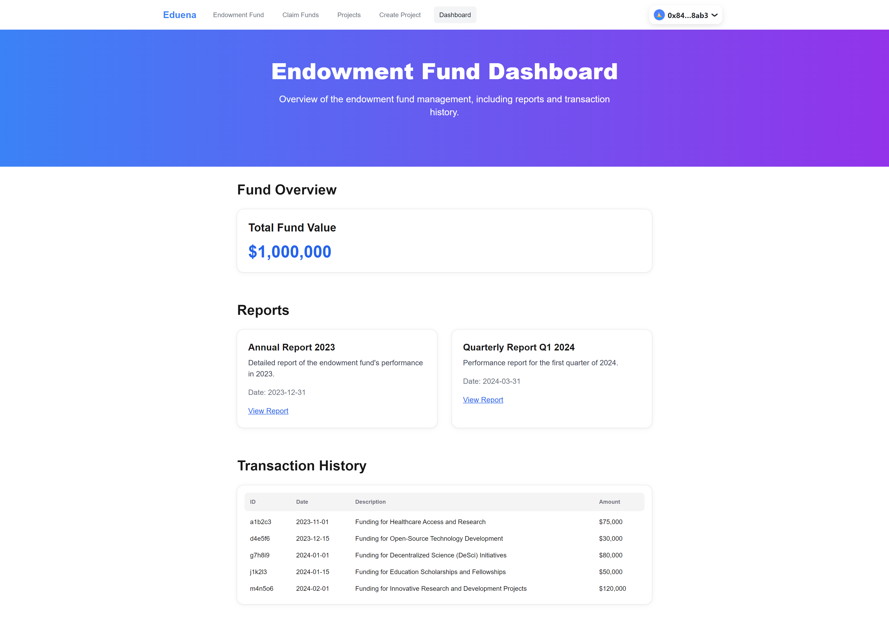
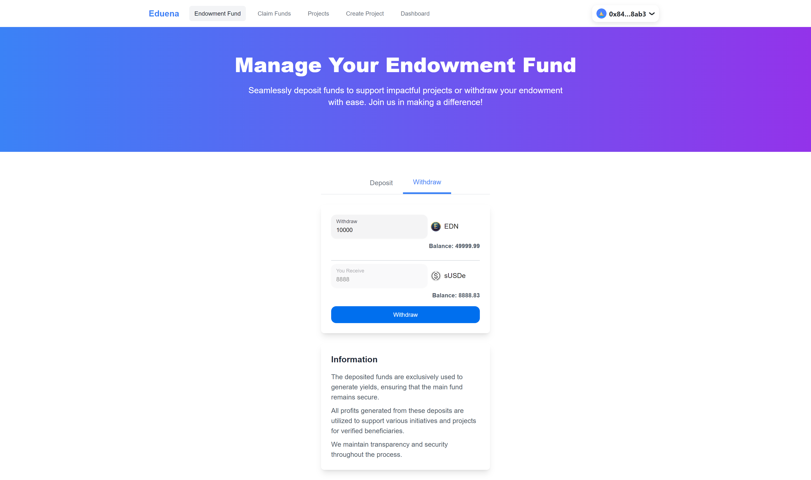
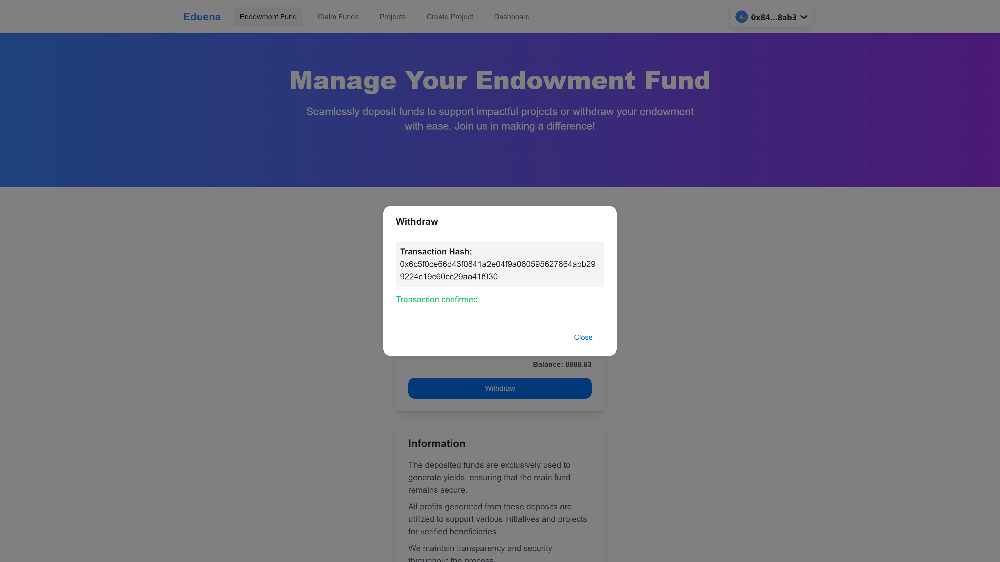

# Eduena

Eduena is a Decentralized Endowment Fund Management platform built on **sUSDe**. It is designed to manage and showcase various projects funded by an endowment fund.

Our platform serves as a hub for initiatives across a wide range of domains, including:

- **Decentralized Science (DeSci)**
- **DAOs**
- **Education**
- **Social Impact**
- And more

Eduena streamlines the processes of project funding, monitoring, and reporting, enabling organizations to manage their endowment funds efficiently and transparently.

## Table of Contents

- [Problems](#problems)
- [Why Invest in Eduena](#why-invest-in-eduena)
- [Key Features](#key-features)
- [How it Works](#how-it-works)
- [Roadmap and Challenges](#roadmap-and-challenges)
- [Demo](#demo)
- [Screenshots](#demo)
- [Technical Details](#technical-details)
- [Team](#team)

## Problems

Endowment Funds are traditionally managed by centralized institutions, which often lack transparency, flexibility, and community involvement. Key problems in the current system include:

- **Limited access and control**: Donors and beneficiaries have minimal say in how funds are managed.
- **Inefficiencies in fund distribution**: Manual processes introduce delays and errors, impacting fund disbursement.
- **High administrative costs**: Centralized intermediaries take a significant portion of fund assets for management.

## Why Invest in Eduena

Eduena is connecting donors, organizations, and beneficiaries transparently and securely. By providing a transparent and efficient platform for project funding and monitoring, we aim to attract more donors and ensure that funds are utilized effectively. Our platform's user-friendly interface and comprehensive features make it an ideal solution for organizations looking to maximize the impact of their endowment funds.

Investing in Eduena means supporting a project that has the potential to drive significant positive change in various sectors, including healthcare, education, technology, and more. Join us in our mission to make a difference through effective endowment fund management.

## Key Features

- **Stake sUSDe**: Stake sUSDe to generate yield for funding community initiatives.
- **Endowment Fund Management**: Securely manage deposits and withdrawals with full transparency.
- **Claim Funds**: Apply for funding via automated, tamper-proof smart contracts.
- **Projects and Initiatives**: Explore funded projects or propose new initiatives for support.
- **Transparency and Governance Dashboard**: Monitor project performance, fund impact, and transactions in real-time with on-chain transparency.

## How It Works

1. **Staking by Donors**  
   Donors stake sUSDe through the Eduena platform. The staked funds are managed as an endowment and invested to generate yield, creating a sustainable resource for funding initiatives.

2. **Fund Distribution Based on Yield**  
   The yield generated from the endowment is distributed to beneficiaries who pass the selection process. This process is automated by smart contracts and follows a predetermined schedule for efficiency and transparency.

3. **Application Process**  
   Beneficiaries register and apply for initiatives through the platform. After completing KYC verification, their applications are processed and verified using smart contracts. Approved beneficiaries receive funds in accordance with the applicable terms.

4. **Reporting and Audit Reports**  
   All transactions and fund usage are transparently displayed on the platform's governance dashboard. Eduena also provides detailed audit reports accessible to donors, ensuring accountability and trust in fund management.

## Roadmap and Challenges

### Roadmap

Our journey to revolutionize decentralized funding and initiative management includes the following key milestones:

1. **Platform Launch and Initial Deployment**

   - Launch the core platform with features such as staking, fund distribution, and beneficiary application modules.
   - Roll out the governance dashboard for transparency and real-time reporting.
   - Conduct comprehensive smart contract audits to ensure security and reliability.

2. **Community Growth and Ecosystem Development**

   - Expand the platform's user base through targeted marketing and community-building efforts.
   - Onboard early adopters, including donors and beneficiaries.
   - Establish strategic partnerships with NGOs, educational institutions, and other organizations.

3. **Advanced Features and Global Outreach**
   - Introduce advanced features such as dynamic yield optimization and impact measurement tools.
   - Expand globally, accommodating multi-currency staking and cross-border initiatives.
   - Scale the platform to support a larger number of projects and community-driven governance.

### Challenges

While our vision is ambitious, we recognize the following challenges and are prepared to address them:

1. **User Adoption**

   - Educating users on the benefits of decentralized funding and staking mechanisms remains a priority.
   - We aim to simplify the onboarding process to attract a broader audience.

2. **Regulatory Compliance**

   - Navigating global regulatory landscapes, including KYC/AML requirements, to ensure compliance and accessibility.

3. **Security and Trust**

   - Maintaining robust security protocols for smart contracts and user funds is critical to building trust.

4. **Sustainability**
   - Ensuring a sustainable balance between yield generation and fund distribution to maximize long-term impact.

## Demo

[Eduena App](https://eduena.netlify.app)

[Watch the Video Demonstration](https://youtu.be/rdNQPTu3Ioc)

### Note

The **Projects**, **Create Project**, and **Dashboard** pages are currently static and serve mock or demonstration purposes only. These pages are designed to showcase the intended user experience and visual layout of the platform. Please note that they do not yet contain full functionality, as we are still in the development phase. We are actively working on integrating these features, and they will be fully functional in upcoming platform releases. Thank you for your understanding as we continue to build and refine the platform.

The Eduena contract is deployed on [Tenderly](https://tenderly.co/) for testing purposes. Information to simulate balance USDe and VETH for gas fee at [Fund account section](https://github.com/Eduena-Endownment-Fund/eduena-contract?tab=readme-ov-file#deployment)

### Screenshots

Here are some screenshots of the Eduena platform:

#### Deposit

#### Deposit Confirmed

#### Projects

#### Create Project

#### Claim Funds

#### Dashboard

#### Withdraw

#### Withdraw Confirmed

### Navigation

- **Endowment Fund Management**: [Endowment Fund](http://eduena.netlify.app/endowment-fund)
- **Claim Funds**: [Claim Funds](http://eduena.netlify.app/endowment-fund/claim-funds)
- **Projects**: [Projects](http://eduena.netlify.app/endowment-fund/projects)
- **Create Project**: [Create Project](http://eduena.netlify.app/endowment-fund/create-project)
- **Dashboard**: [Dashboard](http://eduena.netlify.app/endowment-fund/dashboard)

## Technical Details

### Smart Contract

[Eduena Smart Contract Repository](https://github.com/Eduena-Endownment-Fund/eduena-contract)

### Frontend

- **Frontend**: React, Next.js, TypeScript, Tailwind CSS, Wagmi, Viem, @rainbow-me/rainbowkit
- **UI Components**: @nextui-org/react, @headlessui/react, @heroicons/react
- **Smart Contract Integration**: USDe, sUSDe
- **Virtual TestNets**: [Tenderly](https://tenderly.co/)

### Teams

- Bobby Fiando Sadela
- Ardy Erdiyanto
